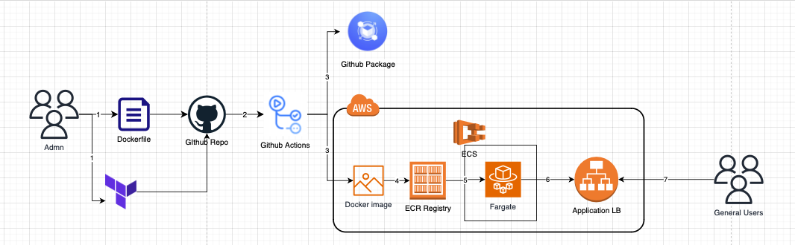

# Github Actions CI/CD Pipline for AWS ECS

## Overview 
- CI: This project aims to publish a docker image to AWS ECR and Github projects with vulnerability scanning tools (eg snyk).
- CD: A simple webapp with application load balancer is created on AWS ECR, which is managed by AWS Fargate. These resources are created using terraform (an IaC tool).
  - Note: the resources will be torn down after 3min.

## Architecture

The diagram illustrates the following workflow: 

**CI: Pushing docker image to Github Package and AWS ECR.**

1. Admin adds/edits dockerfile into github repo with terraform templates.
2. This triggers github actions for CI. It uses vulnerability scanning tool (eg trivy) to check for vulnerabilities in containers. 
3. The workflow builds the Dockerfile and pushes image into Amazon ECR and Github Packages.
4. The docker image is pushed into AWS ECR registry. Admins are able to run CD flow manually in Github Actions. 
(Note: workflow assumes that Amazon ECR has already been created.)

**CD: Creating AWS ECS using Fargate and allow public access using AWS Application Load Balancer.**

1. AWS ECS is created using terraform and it pulls the latest docker image found in ECR. It uses Fargate to manage the ECS instances. 
2. AWS Fargate is attached to an application load balancer, 
3. Users are able to access the application via the load balancer DNS name.

## Technologies Used 
- Github Actions
- AWS
- Terraform 